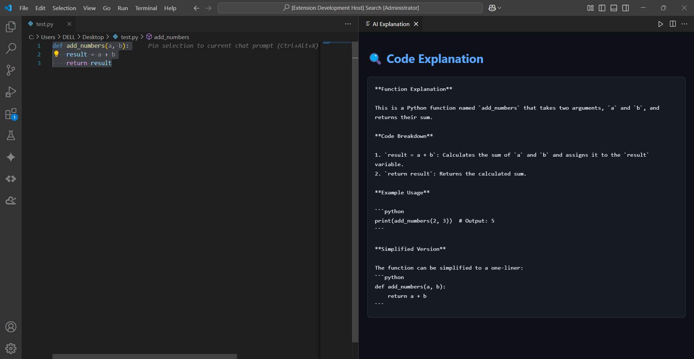
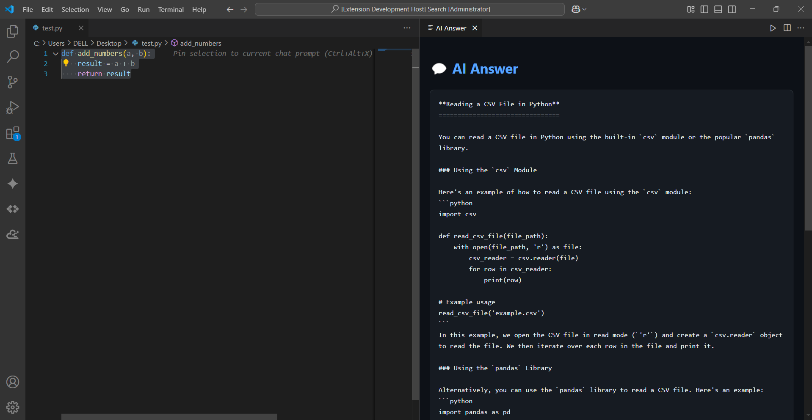
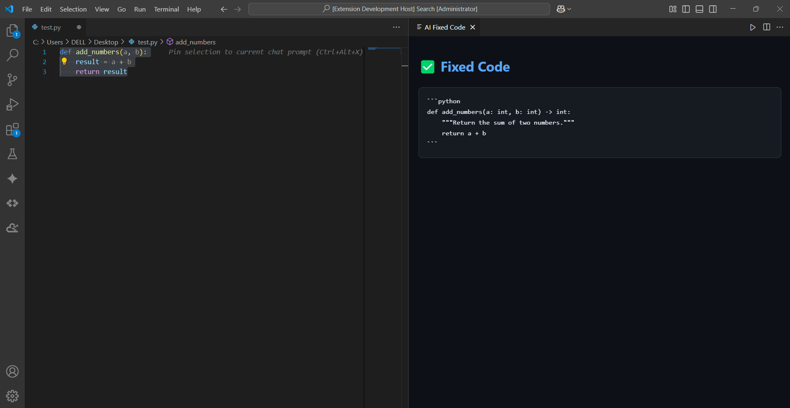
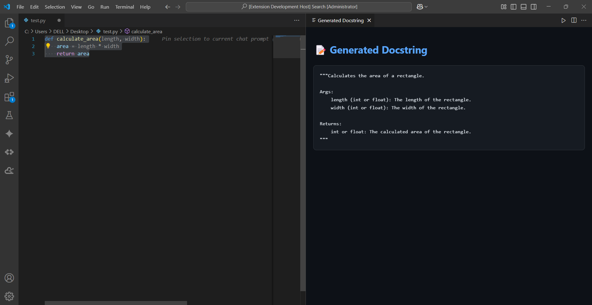
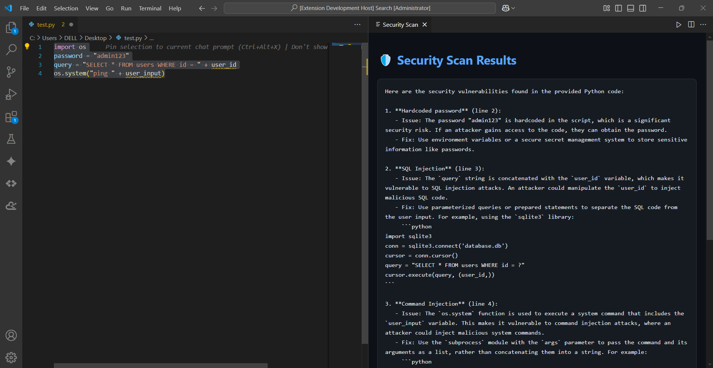

# 🐍 Python AI Assistant — VS Code Extension

An AI pair programmer for Python developers — explain, fix, refactor, and scan code using Groq AI, right inside VS Code.

---

## ✨ Features

| Command | Description |
|---|---|
| 🔍 AI: Explain Code | Explains selected Python code clearly |
| ✅ AI: Fix & Refactor Code | Fixes bugs and improves code quality |
| 🛡️ AI: Security Scan | Detects vulnerabilities with fixes |
| 📝 AI: Generate Docstring | Generates Google-style docstrings |
| 💬 AI: Chat Assistant | Ask any Python question |

---

## 📸 Demo

### 🔍 Explain Code


### 💬 Chat Assistant


### ✅ Fix & Refactor


### 📝 Generate Docstring


### 🛡️ Security Scan


---

## 🚀 Getting Started

### 1. Clone the repo
```bash
git clone https://github.com/javeria163/python-ai-assistant
cd python-ai-assistant
```

### 2. Install dependencies
```bash
npm install
```

### 3. Add your Groq API key
1. Open VS Code Settings (`Ctrl+,`)
2. Search for `pythonAI`
3. Paste your Groq API key in the **Groq Api Key** field

Get a free key at [console.groq.com](https://console.groq.com)

### 4. Run the extension
Press `F5` in VS Code to launch the Extension Development Host.

---

## 🎮 How to Use

**From the Command Palette (`Ctrl+Shift+P`):**
- Type `Python AI` to see all 5 commands

**From the right-click context menu:**
- Select any Python code
- Right-click → choose any Python AI command

---

## 🛠️ Tech Stack

- TypeScript
- VS Code Extension API
- Groq API (llama-3.3-70b-versatile)
- Axios

---

## 📁 Project Structure

```
python-ai-assistant/
├── src/
│   └── extension.ts        # All 5 AI commands live here
├── out/
│   └── extension.js        # Auto-generated by npm run compile
├── .vscode/
│   ├── launch.json         # F5 debug configuration
│   └── tasks.json          # Build tasks
├── package.json            # Commands, menus & extension config
├── tsconfig.json           # TypeScript compiler config
├── .gitignore              # Keeps node_modules & out off GitHub
└── README.md               # Project documentation
```

---

## 👩‍💻 Author

**javeria163** — [github.com/javeria163](https://github.com/javeria163)
